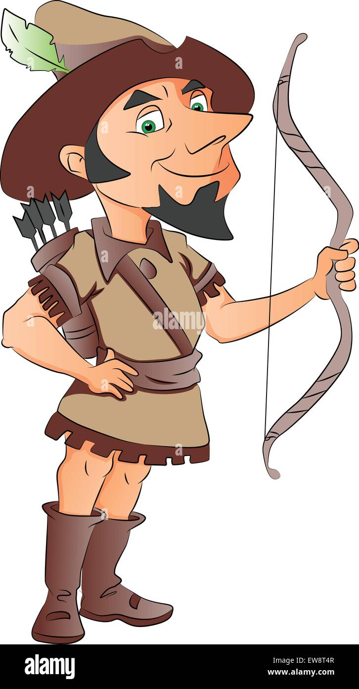

-project titlie: Archery Game

#C#ourse
-Course Number: CS110
-Semester: Fall2024

##Project Overview
- The archery game is a game that the player controls an archer left or right using keyboard left and right key to shoot arrows at targets by clicking the mouse. This game has wind effects that changes the direction of the arrow, score system, and start and end menus. Player gets point if they hit the target. The game ends when the player shoot 5 arrows. 

Additional modules
Pygame https://www.pygame.org/

##Archery image
https://c8.alamy.com/comp/EW8T4R/vector-illustration-of-a-man-with-bow-and-arrow-isolated-on-white-EW8T4R.jpg

##target image
https://corporate.target.com/getmedia/1aeb73c1-89d8-4547-90a0-e787a57270d5/Target_Bullseye-Logo_White.jpg

##Screen shout of GUI

1. **Start Menu Display**
   - **Description**: Verify that the start menu is displayed upon launching the game.
   - **Steps**:
     1. Launch the game.
     2. Observe the start menu screen.
   - **Expected Result**: The screen should display the title "Archery Game" and a prompt to press SPACE to start.

2. **Archer Movement**
   - **Description**: Test the left and right movement of the archer.
   - **Steps**:
     1. Press the LEFT arrow key to move the archer left.
     2. Press the RIGHT arrow key to move the archer right.
   - **Expected Result**: The archer moves left and right accordingly, within the screen boundaries.

3. **Arrow Shooting**
   - **Description**: Test shooting an arrow and observe the arrow's trajectory.
   - **Steps**:
     1. Click the mouse button to shoot an arrow.
     2. Observe the arrow as it moves upwards.
   - **Expected Result**: The arrow moves upwards and is influenced by wind strength.

   4. **Wind Effect Display**
   - **Description**: Check if the wind effect (direction and strength) is displayed properly.
   - **Steps**:
     1. Start the game.
     2. Observe the wind direction and strength displayed on the screen.
   - **Expected Result**: The wind effect should be displayed at the bottom of the screen.

5. **End Menu**
   - **Description**: Verify that the end menu is displayed after reaching a score of 3.
   - **Steps**:
     1. Play the game until you reach a score of 3.
     2. Observe the end screen.
   - **Expected Result**: The screen should display the final score and options to restart or quit.

